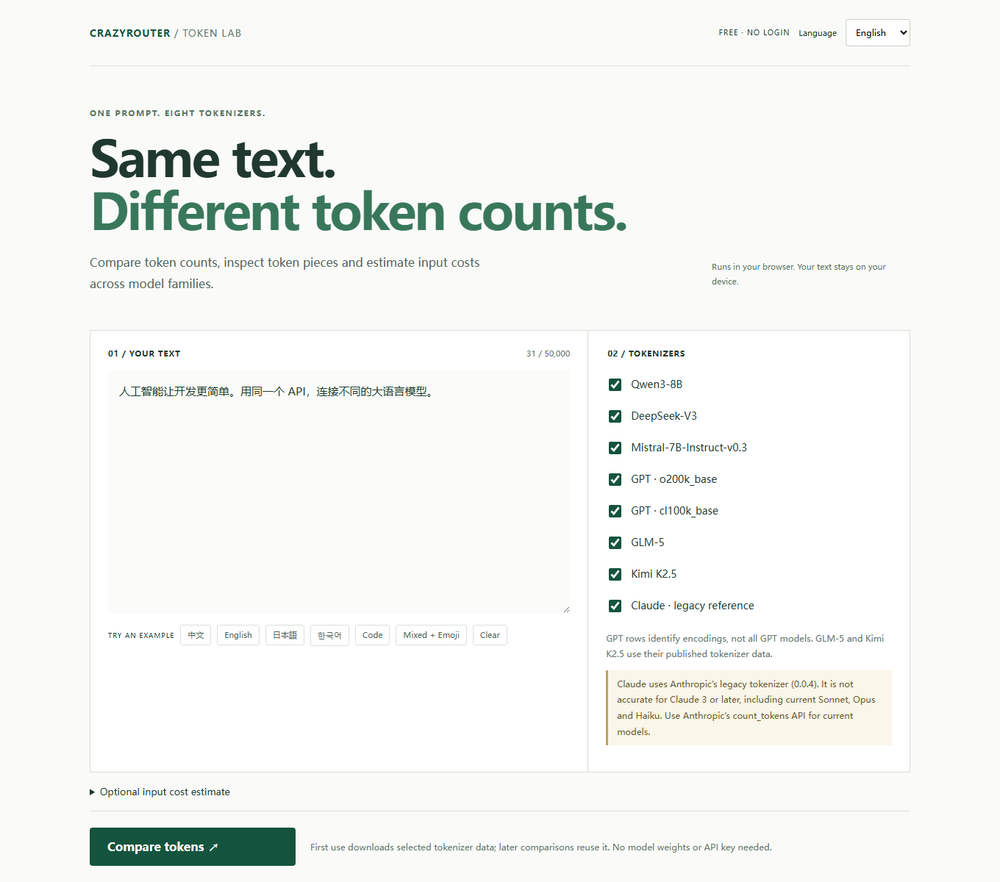

# CrazyRouter 开发者工具

在接入 API 前，比较分词器、估算费用、查看文本和图片模型的真实样例。

**[打开工具导航](https://xujfcn.github.io/crazyrouter-tools/github/zh.html)** · [English](README.md)

| 工具 | 用途 | 在线体验 |
| --- | --- | --- |
| 分词器对比 | 8 种分词器，中英日韩四语，token 数量、ID 与输入费用估算 | [打开](https://xujfcn.github.io/crazyrouter-tools/tokenizer-comparison/?lang=zh) |
| API 费用计算器 | 按工作负载估算费用，查看带日期的价格快照 | [打开](https://xujfcn.github.io/crazyrouter-tools/github/pricing-calculator/) |
| 模型竞技场 | 相同提示词、记录样例、明确判定方法，自带密钥实时对比 | [打开](https://xujfcn.github.io/crazyrouter-tools/github/model-arena/zh.html) |
| 图片竞技场 | 相同提示词的图片画廊与可选实时生成 | [打开](https://xujfcn.github.io/crazyrouter-tools/github/image-arena/zh.html) |
| JEV 决策工具 | 分类、概率判断和路由场景 | [打开](https://xujfcn.github.io/crazyrouter-tools/github/jev-playground/zh.html) |



分词器和费用计算器无需注册或密钥；模型和图片样例可以免费浏览。**实时模型调用使用你自己的 API Key，可能产生费用**，打开页面不会自动调用模型。

Claude 使用官方旧版分词器，**不代表当前 Claude 3+ 模型的精确计数**。纯文本 token 数不包含系统消息、工具、图片及其他协议开销。实际账单以 API 返回的用量为准。竞技场样例不能证明模型身份或完整能力。

## 本地运行

```sh
git clone https://github.com/xujfcn/crazyrouter-tools.git
cd crazyrouter-tools
python -m http.server 8000
```

打开 `http://localhost:8000/github/zh.html`。分词器独立源码位于 [projects/tokenizer-comparison](projects/tokenizer-comparison/)，可运行 `npm ci`、`npm test` 和 `npm run dev`。

## 下一步：接入应用

[查看当前价格](https://crazyrouter.com/models?utm_source=github&utm_medium=github_readme&utm_campaign=tools_hub&utm_content=zh_pricing) · [API 文档](https://docs.crazyrouter.com/?utm_source=github&utm_medium=github_readme&utm_campaign=tools_hub&utm_content=zh_docs) · [创建账号](https://crazyrouter.com/register?utm_source=github&utm_medium=github_readme&utm_campaign=tools_hub&utm_content=zh_register)

分词器输入只在浏览器内处理；竞技场的密钥只保留在页面内存中，并发送给你选择的 API 地址。对外链接仅携带来源参数，不包含输入文本或密钥。价格快照与样例均有时间口径，请在使用前核对。

欢迎提交可复现问题、翻译改进和新工具建议，详见 [贡献指南](CONTRIBUTING.md)。不要在 Issues 中提交密钥或敏感输入。各组件保留自己的许可证与第三方声明。

## 搜索问题与使用指南

- [Token 是什么？中文怎么算、1K/1M Token 与分词器对比](https://xujfcn.github.io/crazyrouter-tools/github/what-is-a-token/)
- [API 费用怎么算？GPT、Claude、DeepSeek Token 计费计算器](https://xujfcn.github.io/crazyrouter-tools/github/api-cost-calculator/)
- [GPT 满血与残血怎么测试？大模型降智排查与 API 对比](https://xujfcn.github.io/crazyrouter-tools/github/gpt-full-vs-degraded-test/)
- [生图 AI 哪个好？GPT Image、Nano Banana、Seedream 同提示词对比](https://xujfcn.github.io/crazyrouter-tools/github/ai-image-generator-comparison/)
- [JEV 是什么？JEV 1.13 在线体验、分类判断与 Agent 路由示例](https://xujfcn.github.io/crazyrouter-tools/github/jev-playground-guide/)

[Keyword and canonical map](docs/seo-keyword-map.md)
